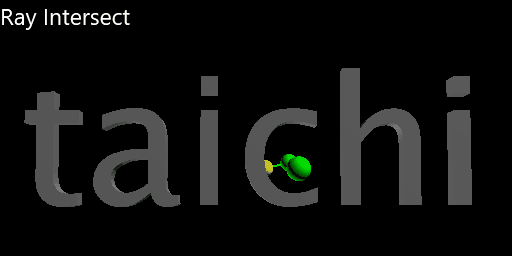

# ti-bvh
- Bounding volume hierarchy with taichi

## How to run 
* First config your anaconda workspace, and open the anaconda prompt
  
* Second you need install dependency  
  ```python
  pip install -r requirements.txt
  ```

* Last you type 
  ```python
  ti Demo.py
  ```

## What can it do
- **Fast Intersect** triangle mesh by ray using bvh
- **Singed distance query** using bvh
- Primitive abstraciton supporting triangle,sphere,quad,box
- Bvh Interface abstraciton which means we can implement more kinds of bvh in the future

## Gallery



## Reference
- [lvbh](https://developer.nvidia.com/blog/thinking-parallel-part-iii-tree-construction-gpu/)

